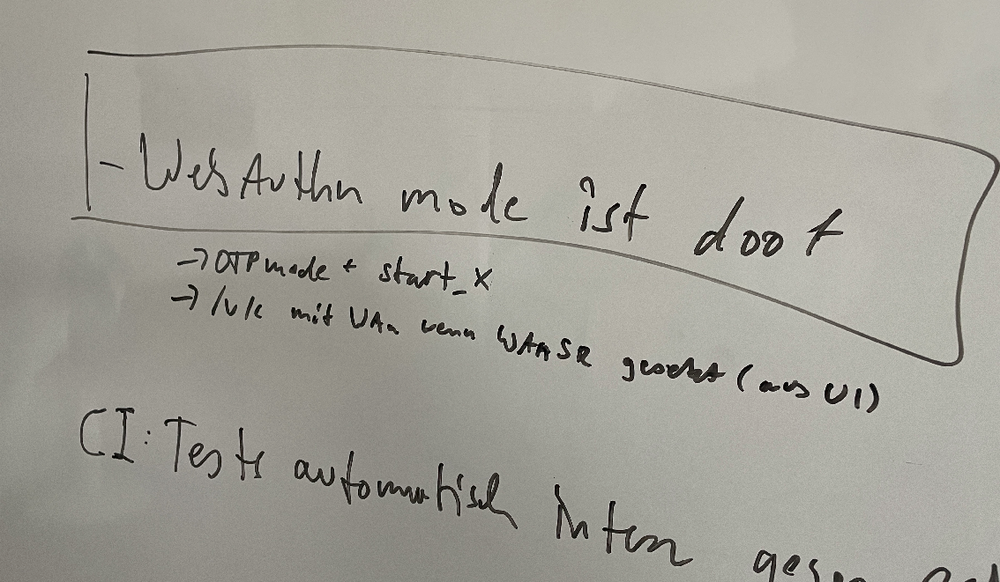

<!--
# Abstract

Neue Mitarbeiter kommen als neue Benutzer in die Firma. Welche Anforderungen kann man an die Onboarding- und Rollout-Prozesse in Bezug auf Credentials für die Mitarbeiter stellen. Auch für kleine Unternehmen ist dies eine Herausforderung.

In Unternehmen sollen Mitarbeiter einen zweiten Faktor ausgerollt bekommen. Worauf ist dabei zu achten? Wie können Prozesse abgebildet werden, damit der zweiten Faktor eine höhere Vertrauensstufe hat, als das möglicher Weise kompromittierte Passwort?

Konzerne, Forschungseinrichtungen, Rechenzentren haben tausende, weltweit verteilte Benutzer zu bedienen. Wo liegen die Schwachstellen und wie kann man diesen begegnen?

Aus Erfahrungen mit Projekte/Kunden werde ich berichten, welche Herausforderungen
beim on- und offbording in 2FA bestehen.

Jeder hat nun eine Vorstellung von 2FA. Wie er sie persönlich nutzt. Aber was heißt das
für Unternehmen, Organisationen, Universitäten...?

Sichere MFA heißt nicht nur die beste Crypto:
Sondern auch Prozesse sicher zu gestalten.

-->

# On- und offboarding von Benutzern

## Security Meetup, 26.04.2023

---

# Ich bin...

- Cornelius Kölbel
- NetKnights
- privacyIDEA

---

# Disclaimer

Ich habe schon viel über das Thema geredet - es ist mein täglich Brot,
mit dem wir unser Geld verdienen. Insofern ist das hier nichts Neues sondern ggf.
ein Kompilat aus Bestehendem.

Mischung mit eigenen Erfahrungen aus einem 12-Mann-Unternehmen.

Genauso bin ich gespannt, was Ihr dazu sagt.

---

# Wer seid Ihr?

* Personalverantwortung?
* In Mitarbeiter-Onboarding involviert?
* Als IT/Admin in Rollout-Prozesse involviert?
* Selber neulich ein Onboarding erlebt?

---

# Meine Motivation
- "nur" 4 Einstellungen im Jahr 2022
    - dennoch wichtig: Definition, Prozesse, Automatisierung
- Idee Q3/2022
- Meetup startet wieder durch

---

# Roter Faden

- Ressourcen
- Reale Beispiele
- Herausforderungen und Fallstricke
- Lösungen und Werkzeuge

---

# Ressourcen 1/2

## Vorträge / Videos

- Security Meetup 2023 / On- und Offboarding (This one!)
  https://privacyidea.org/talks/2023/
- Kielux 2022 / Die Zukunft der Mehr-Faktor-Authentifizierung
  https://www.youtube.com/watch?v=5v05JD-adsE&list=PLQwShAieqyfetGKYGoYdql-6AStjgjy5M&index=2
- Ohio 2022 / Solving Organizational Challenges
  https://www.youtube.com/watch?v=ucWF2fuZqW0&list=PLQwShAieqyfetGKYGoYdql-6AStjgjy5M&index=4
- Chemnitz 2017 / Mehr-Faktor-Authentifizierung für 35.000 Benutzer
  https://www.youtube.com/watch?v=aHER8qUP5Oo

---

# Ressourcen 2/2

## Podcasts

- Rollout-Konzepte für einen zweiten Faktor
  https://open.spotify.com/episode/0vQCXJqZkPL1PC3OSb99Y7
- Alles Prozesse oder was?
  https://open.spotify.com/episode/65sE7XAnacPfldXjwgljkU

---

# Reale Beispiele - Das Familienunternehmen

## Status

- Dutzend Mitarbeiter
- Wiki und Skripte (für IT aber auch Personal)
    - *Mehrere* Accounts werden angelegt (trotz SSO) mit PW und Gruppen
    - Credentials/Passwörter erzeugt
    - Yubikey wird initialisiert mit entsprechenden 2FA/Crypto
    - Notebook, YK, PW-Umschlag wird vorbereitet und übergeben
    - Benutzer kommt, wird eingewiesen und setzt Passwörter zurück
- Rollenbeschreibungen im Benutzerhandbuch
- Für Aufgaben existieren Ablaufbeschreibungen/Videos
- Ziele für die ersten 6 Monate

---

# Reale Beispiele - Das Familienunternehmen

*Schön*:

- Prozess ist **definiert** und immer gleich (Es ist klar, was zu tun ist)
- Mitarbeiter wird in **Empfang** genommen (komplette Vorbereitung)
- Benutzer wird **persönlich** betreut. Rückfragen schnell beantworten.
- Berechtigungen als Rollen aus **Gruppenzugehörigkeit**.

---

*Doof*:

- Einige Dinge erfordern **persönliche** Betreuung (sehr technisch)
- **Zu viele** Passwörter (sehr technisch)
- Trotz Prozess, immer noch **manuelle** Arbeit

---

# Reale Beispiele - 30.000 Studenten

(vgl. CLT 2017)

## Status

- 5000 Studenten kommen und gehen im Semester
- Studentwelcomepack (physisches Paket)
- Es existiert eine eigene Druckerei
- Student wird zentral im IdM angelegt
    - Über REST API wird Registrierungscode im privacyIDEA erzeugt
    - Über Event Handler wird Registrierungscode an Druckerei geschickt
    - In SWP eingetütet
    - Student fängt an zu studieren, nutzt den Reg-Code, um sich einen zweiten
      Faktor im Selfservice auszurollen.

---

# Reale Beispiele - 30.000 Studenten

*Schön*:

- Hoher Automatisierungsgrad bei Rollout und Recover. (IT macht Urlaub)

*Doof*:

- Prozessdesign und Umsetzung langwierig
- Prozess aufgrund der fehlenden persönlichen Identifizierung
  aufwändig sicher zu gestalten.

---

# Reale Beispiele - Facility Management

*Ein Onboarding- oder Rolloutprozess sollte* ***robust*** *und* ***flexibel*** *sein.*

(vgl. Kielux 2022)

- Prozess zum Rollout von 10K HW-Token
- Existenter HW-Token wird einem Benutzer zugeordnet
- HW-Token wird dem Benutzer übergeben

---

[(CC) Rosenfeld Media](https://www.flickr.com/photos/rosenfeldmedia/52597293760)

---

# Reale Beispiele - Facility Management

*Betrachtung*: **Evergiven**

- Wie schnell ist das Onboarding/Rollout anpassbar?
- Single Point of Failure?
- Wechsel von HW-Token zu Smartphone Apps

---

# Reale Beispiele - Eure?

- Was macht Ihr? Wie läuft es bei Euch?
- Seid Ihr selber ins Onboarding involviert?
- Wie habt Ihr Eure Einstellung erlebt?

---

# Herausforderungen und Fallstricke

(vgl. Ohio Linux Fest, 2022)

*UNIs: Was wir nicht nachvollziehen können:*

* Laut Unis fällt Studenten i.d.R. am Abend vor der Anmeldefrist ein, dass sie sich
  noch für die Prüfung anmelden müssen.

* Party, Wodka und anders, kann dazu führen, dass Handys im Klo landen.

 ---

# Herausforderungen und Fallstricke

- Wo liegen Benutzer?
    - Zentral?
    - Mehrere Quellen?
    - Können dort Rollen abgebildet werden?
    - Können die von allen Applikationen gelesen werden?
    - Zweiten Faktor zuweisen?

- Wo liegen Credentials und zweite Faktoren?

---

# Herausforderungen und Fallstricke

Übergang von der *Identität* zum *Benutzeraccount*

- Benutzer muss identifiziert.
    - Im eigenen Unternehmen -> Personalabteilung
    - Im Forschungsinstitut -> ???    

---

# Herausforderungen und Fallstricke

*Trust Anchor*

- Speziell beim zweiten Faktor: Die Sicherheit des zweiten Faktors
  kommt aus dem Nichts
  (Gestern noch 1FA und jetzt einfach 2FA)
- vgl. Rollout im Plugin

---

# Herausforderungen und Fallstricke

*Over Engineering*

- Beim Versuch, das kryptografisch sicherste Verfahren zu finden, bleibt der Prozess
  auf der Strecke.
- Achtung: Kompliziert Infrastruktur mit PUSH.  
- FIDO2 Rant! :-) [zentrales Management]

**Secure authentication is a matter of smooth workflows**

---

# Herausforderungen und Fallstricke

*Leben und Sterben*: Das Offboarding

- Einziehen oder Deaktivieren der *Authentisierungsobjekte*
    - gerade auch bei externen Diensten (Amazon)
- FIDO2 Rant! :-) [zentrales Management]

---

# FIDO2 - Webauthn

---

# Herausforderungen und Fallstricke

*Benutzerakzeptanz*

- Was sind Benutzer bereit zu tun?
    - Smartphone (Lehrer)
    - Handynummer (Lehrer)

---

# Herausforderungen und Fallstricke

- Vendor-Lock-In
- Technologie-Lock-In        

---

# Tools, die einem zur Verfügung stehen

Wie kann man es nun angehen?

*Technisch*:

* Gruppenberechtigungen. Mitarbeiter können schneller skaliert oder ersetzt werden.
* bash
* SSO/IdP
* privacyIDEA: Automatisierung, Flexibilität

---

*Einweisung/Organisatorisch*:

* Alles fertig haben
* Mitarbeiterhandbuch mit definierten Rollenbeschreibungen
* Buddy
* wiki
* Videos
* Aufgaben/Ziele für die Probezeit

---

- Security Meetup 2023 / On- und Offboarding (This one!)
  https://privacyidea.org/talks/2023/

